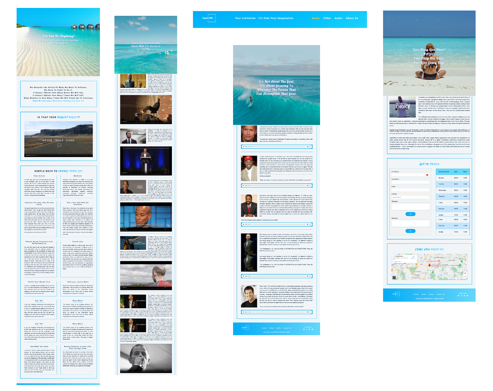

# InspireMe

### [Live Site](https://inspire-me-your-motivation.netlify.app)

## Description

InspireMe is a university project from the web development module and by the case scenario aims to inspire users by providing them with a compilation of motivational speeches and videos from guest speakers. The current repository is a rework of the original project.

## Screenshot

## 🛠️ Built with:

and GSAP

## 💾 Installation

- Clone the repository: `git clone https://github.com/rado-kolev/inspire-me.git`.
- If using VS Code, open the `index.html` file and run it with the extension 'Live Server'. If using a different code editor, run the file with the available localhost.
